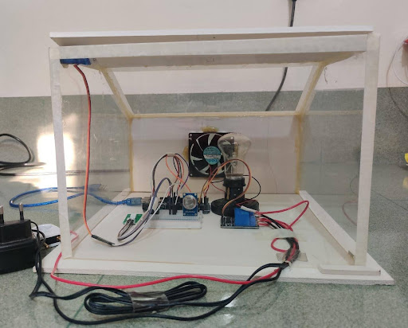

+++
date = "2024-11-25T12:00:00-00:00"
title = "Smoke and Fire Detection System"
+++

The Smoke and Fire Detection System with Automated Ventilation is an innovative safety solution designed to detect hazardous conditions in enclosed spaces and respond effectively by improving ventilation. This project highlights the integration of sensors, actuators, and software for real-time monitoring and automated responses to mitigate fire-related risks efficiently.

<!--more-->

*Caption: Smoke and Fire Detection System in an Enclosed Room*

#### Project Details
- **Project Type:** Academic Project (Solo)
- **Course Name:** Measurement, Instrumentation and Control (MIC) Lab
- **Degree:** BSc in Mechanical Engineering
- **Institution:** Islamic University of Technology (IUT)
- **Semester:** 4th semester
- **Grade Achieved:** A+

---

*Caption: Ventilation window*

#### Key Features

- **Integrated Automation:** Combines temperature and smoke detection with automated responses for ventilation and cooling.
- **Innovative Room Design:**
  - The room has a **sloped roof**, preventing smoke from being trapped in the corners and enabling smooth airflow toward the ventilation window.
  - Enhances the system’s efficiency in removing smoke and heat, cooling the room in a shorter time.
- **Dynamic Heat Control:** A self-regulating bulb and fan system maintains stable room conditions.
- **User-Friendly Monitoring:** Real-time data visualization through **LabVIEW 2021** ensures clear system feedback.

---

*Caption: Front view of the room*

#### System Components

- **Arduino Board:** Processes sensor inputs and controls outputs like the stepper motor, fan, and relay.
- **MQ-2 Smoke Sensor:** Monitors the concentration of smoke in the air and sends analog signals to the Arduino.
- **Temperature Sensor:** Monitors the room temperature.
- **Stepper Motor:** Controls the opening and closing of a small ventilation window located at the top of the room.
- **Bulb:** Simulates heat generation to test the system’s ability to detect and respond to rising temperature.
- **Fan:** Expels smoke and heat efficiently.
- **Relay Module:** Controls the fan and bulb operation.
- **Breadboard:** Used for circuit assembly.

---

*Caption: Side view of the room*

#### Working Mechanism

##### 1. Data Collection
Sensors continuously monitor smoke levels and room temperature.

##### 2. Dynamic Bulb and Fan Control
- The **bulb**, used to simulate heat, turns off when the room temperature exceeds a set level.
- The **fan** turns on simultaneously to reduce the room’s temperature.
- Once the temperature drops below the threshold, the bulb turns on again, and the fan turns off, ensuring continuous testing conditions.

##### 3. Innovative Room Design
- The room has a **sloped roof** to prevent smoke from being trapped in the corners and allow smooth airflow toward the ventilation window.
- This design enhances the system’s efficiency in removing smoke and heat, cooling the room in a shorter time.

##### 4. Ventilation Activation
- If the temperature or smoke level exceeds thresholds, the Arduino triggers the stepper motor to open the ventilation window.
- The sloped roof ensures smooth airflow, rapidly expelling smoke and heat.

##### 5. Real-Time Visualization
- **LabVIEW 2021** provides a graphical interface for real-time monitoring of sensor data and system actions.

---

#### Achievements and Results

- Successfully demonstrated dynamic control of heat generation and automated ventilation to efficiently manage room conditions.
- The **sloped roof design** ensured rapid removal of smoke and heat.
- Seamless integration between hardware components (assembled on a breadboard) and **LabVIEW** for real-time monitoring.
- Received an **A+ grade** in the **Measurement, Instrumentation and Control Lab** for its innovative approach and flawless execution.
